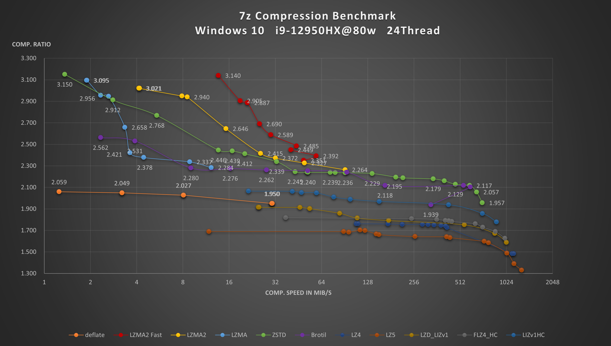

# FastLZMA2Net

Fast LZMA2 Wrapper for .NET

⚠️Library is beta test⚠️

⚠️API may have breaking change⚠️

[Change Log](ChangeLog.md)

With respect to [Fast LZMA2](https://github.com/conor42/fast-lzma2)



# Requirements

**Windows x86/64 .NET 8 runtime**

It is reconmended using x64. 

x86 may have potential malfunction.

# Installation

`PM> Install-Package FastLZMA2Net -prerelease`

# Usage

### Simple compression

When using compression occasionally

``` c#
string SourceFilePath = @"D:\dummy.tar";
string CompressedFilePath = @"D:\dummy.tar.fl2";
string DecompressedFilePath = @"D:\dummy.recovery.tar";

// Simple compression
byte[] origin = File.ReadAllBytes(SourceFilePath);
byte[] compressed = FL2.Compress(origin,0);
byte[] decompressed = FL2.Decompress(compressed);
```

### Context Compression

When you have many small file, consider using context to avoid alloc overhead

```c#
// Context compression, context can be reuse.
Compressor compressor = new(0) { CompressLevel = 10 };
compressed = compressor.Compress(origin);
compressed = compressor.Compress(origin);
compressed = compressor.Compress(origin);

Decompressor decompressor = new Decompressor();
decompressed = decompressor.Decompress(compressed);
decompressed = decompressor.Decompress(compressed);
decompressed = decompressor.Decompress(compressed);
```


### Streaming Compression 

When you have a very large file (>2GB) or slow I/O

``` c# 
byte[] buffer = new byte[256 * 1024 * 1024]; 
// use 256MB input buffer 
// This is suitable for most cases
``` 
### small file or data (<2GB)
``` c# 
// compress
using (MemoryStream ms = new MemoryStream())
{
    using (CompressStream cs = new CompressStream(ms))
    {
        cs.Write(origin);
    }
    compressed = ms.ToArray();
}
// decompress
using (MemoryStream recoveryStream = new MemoryStream())
{
    using (MemoryStream ms = new MemoryStream(compressed))
    {
        using (DecompressStream ds = new DecompressStream(ms))
        {
            ds.CopyTo(recoveryStream);
        }
    }
    decompress = recoveryStream.ToArray();
}
```

### Large file or data (>2GB)

When processing Large file, It is not acceptable reading all data into memory.

And .NET array have size limit <2GB 

It is recommended to using DFA(direct file access) streaming.

Have tested on a 7GB file. 

```c#
//large file streaming compression using Direct file access(>2GB)
using (FileStream compressedFile = File.OpenWrite(CompressedFilePath))
{
    using (CompressStream cs = new CompressStream(compressedFile))
    {
        using (FileStream sourceFile = File.OpenRead(SourceFilePath))
        {
            //DO NOT USE sourceFile.CopyTo(cs)
            // CopyTo() calls Write() inside, which terminate stream after 1 cycle.
            long offset = 0;
            while (offset < sourceFile.Length)
            {
                long remaining = sourceFile.Length - offset;
                int bytesToWrite = (int)Math.Min(64 * 1024 * 1024, remaining);
                sourceFile.Read(buffer, 0, bytesToWrite);
                cs.Append(buffer, 0, bytesToWrite);
                offset += bytesToWrite;
            }
            // make sure always use Flush() after all Append() complete
            // Flush() add checksum to stream and finish streaming.
            cs.Flush();
        }
    }
}

//large file streaming decompress(>2GB)
using (FileStream recoveryStream = File.OpenWrite(DecompressedFilePath))
{
    using (FileStream compressedFile = File.OpenRead(CompressedFilePath))
    {
        using (DecompressStream ds = new DecompressStream(compressedFile))
        {
            ds.CopyTo(recoveryStream);
        }
    }
}
```

# Bug report 

Open an issue.

# Contribution

PR is welcome.

