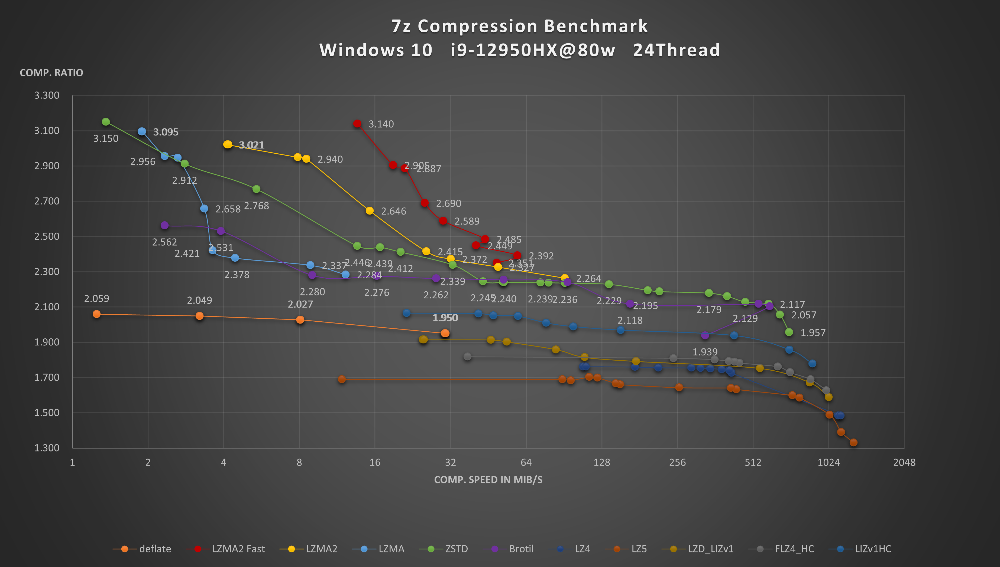

# FastLZMA2Net

 [![][fastlzma2net-stars-shield]][fastlzma2net-stars-link]
 [![][fastlzma2net-license-shield]][fastlzma2net-license-link]
 [![][fastlzma2net-release-shield]][fastlzma2net-release-link]
 [![][fastlzma2net-releasedate-shield]][fastlzma2net-releasedate-link]
 [![][fastlzma2net-nuget-shield]][fastlzma2net-nuget-link] 
 [![][fastlzma2net-downloads-shield]][fastlzma2net-downloads-link]

Fast LZMA2 Compression algorithm Wrapper for .NET

⚠️This library is not designed to generate valid 7z archives; it is solely responsible for compressing and decompressing individual byte streams.

[Change Log](ChangeLog.md)

With respect to [Fast LZMA2 repo](https://github.com/conor42/fast-lzma2)



# Requirements

**.NET 8 / .NET 10**

| OS | Architectures |
|---|---|
| Windows | x64 · x86 · arm64 |
| Linux (glibc) | x64 · x86 · arm64 · arm |
| Linux (musl / Alpine) | x64 · arm64 |

> x86 may have potential malfunction.

# Installation

`PM> Install-Package FastLZMA2Net`

# API Overview

| Class | Description |
|---|---|
| `FL2` | Static helpers — one-shot compress / decompress, memory estimation |
| `Compressor` | Reusable compression context |
| `Decompressor` | Reusable decompression context |
| `CompressStream` | Streaming compression (`Stream` subclass) |
| `DecompressStream` | Streaming decompression (`Stream` subclass) |

# Usage

### Simple compression

```csharp
byte[] origin       = File.ReadAllBytes(sourceFilePath);
byte[] compressed   = FL2.Compress(origin, level: 6);
byte[] decompressed = FL2.Decompress(compressed);
```

`ReadOnlySpan<byte>` overloads are available to avoid a copy when data is already in a pooled or stack-allocated buffer:

```csharp
ReadOnlySpan<byte> span = ...;
byte[] compressed = FL2.Compress(span, level: 6);
```

### Multi-threaded one-shot compression

```csharp
byte[] compressed   = FL2.CompressMT(origin, level: 6, nbThreads: 0);  // 0 = all cores
byte[] decompressed = FL2.DecompressMT(compressed, nbThreads: 0);
```

### Context Compression

Reuse a `Compressor` / `Decompressor` to amortize context-allocation cost across many calls (e.g. batches of small files).

```csharp
using Compressor compressor = new(nbThreads: 0) { CompressLevel = 10 };
byte[] c1 = compressor.Compress(data1);
byte[] c2 = compressor.Compress(data2);

using Decompressor decompressor = new();
byte[] d1 = decompressor.Decompress(c1);
byte[] d2 = decompressor.Decompress(c2);
```

### Async compression

```csharp
using Compressor compressor = new(nbThreads: 0) { CompressLevel = 6 };
byte[] compressed = await compressor.CompressAsync(origin, cancellationToken);

using Decompressor decompressor = new();
byte[] decompressed = await decompressor.DecompressAsync(compressed, cancellationToken);
```

### File-to-file compression (no memory copy)

Uses memory-mapped I/O — no full read into managed memory.

```csharp
using Compressor compressor = new(nbThreads: 0) { CompressLevel = 6 };
nuint compressedBytes = compressor.Compress(sourceFilePath, destFilePath);
```


### Streaming Compression

`CompressStream` is a writable `Stream` and `DecompressStream` is a readable `Stream`.
Pipe any stream in or out via `Write` / `CopyTo` / `CopyToAsync` — there is no size restriction.
The compress stream is finalised automatically when `Dispose()` is called.

**Compress**

```csharp
// in-memory
using MemoryStream ms = new();
using (CompressStream cs = new(ms) { CompressLevel = 10 })
    cs.Write(origin);
byte[] compressed = ms.ToArray();

// file (works for any size)
using FileStream sourceFile     = File.OpenRead(sourceFilePath);
using FileStream compressedFile = File.Create(compressedFilePath);
using (CompressStream cs = new(compressedFile) { CompressLevel = 10 })
    sourceFile.CopyTo(cs);
```

**Compress (async)**

```csharp
await using FileStream sourceFile     = File.OpenRead(sourceFilePath);
await using FileStream compressedFile = File.Create(compressedFilePath);
await using (CompressStream cs = new(compressedFile) { CompressLevel = 10 })
    await sourceFile.CopyToAsync(cs);
```

**Decompress**

```csharp
// in-memory
using MemoryStream recoveryStream = new();
using (DecompressStream ds = new(new MemoryStream(compressed)))
    ds.CopyTo(recoveryStream);
byte[] decompressed = recoveryStream.ToArray();

// file (works for any size)
using FileStream compressedFile = File.OpenRead(compressedFilePath);
using FileStream recoveryFile   = File.Create(decompressedFilePath);
using (DecompressStream ds = new(compressedFile))
    ds.CopyTo(recoveryFile);
```

### Fine-tune compression parameters

```csharp
using Compressor compressor = new(nbThreads: 0) { CompressLevel = 10 };
compressor.SetParameter(FL2Parameter.FastLength, 48);
compressor.SetParameter(FL2Parameter.SearchDepth, 60);
```

### Estimate memory usage

```csharp
// By compression level and thread count
nuint size = FL2.EstimateCompressMemoryUsage(compressionLevel: 10, nbThreads: 8);

// Using an existing context's settings
using Compressor compressor = new(nbThreads: 4) { CompressLevel = 10 };
nuint size = FL2.EstimateCompressMemoryUsage(compressor.CompressLevel, compressor.ThreadCount);
```

### Find decompressed size

```csharp
// From a byte array
nuint size = FL2.FindDecompressedSize(compressedData);

// From a file path (uses memory-mapped I/O — no full read into memory)
nuint size = FL2.FindDecompressedSize(compressedFilePath);
```

# Bug report 

Open an issue.

# Contribution

PR is welcome.

[fastlzma2net-link]: https://github.com/kingsznhone/FastLZMA2Net
[fastlzma2net-cover]: https://raw.githubusercontent.com/kingsznhone/FastLZMA2Net/main/readme/benchmark.png
[fastlzma2net-stars-shield]: https://img.shields.io/github/stars/kingsznhone/FastLZMA2Net?color=ffcb47&labelColor=black&style=flat-square
[fastlzma2net-stars-link]: https://github.com/kingsznhone/FastLZMA2Net/stargazers
[fastlzma2net-license-shield]: https://img.shields.io/github/license/kingsznhone/FastLZMA2Net?labelColor=black&style=flat-square
[fastlzma2net-license-link]: https://github.com/kingsznhone/FastLZMA2Net/blob/main/LICENSE
[fastlzma2net-release-shield]: https://img.shields.io/github/v/release/kingsznhone/FastLZMA2Net?color=369eff&labelColor=black&logo=github&style=flat-square&include_prereleases
[fastlzma2net-release-link]: https://github.com/kingsznhone/FastLZMA2Net/releases
[fastlzma2net-releasedate-shield]: https://img.shields.io/github/release-date-pre/kingsznhone/FastLZMA2Net?labelColor=black&style=flat-square
[fastlzma2net-releasedate-link]: https://github.com/kingsznhone/FastLZMA2Net/releases
[fastlzma2net-nuget-shield]:https://img.shields.io/nuget/v/FastLZMA2Net?style=flat-square&labelColor=000000
[fastlzma2net-nuget-link]:https://www.nuget.org/packages/FastLZMA2Net/
[fastlzma2net-downloads-shield]:https://img.shields.io/nuget/dt/FastLZMA2Net?style=flat-square&logo=nuget&labelColor=black
[fastlzma2net-downloads-link]:https://www.nuget.org/packages/FastLZMA2Net


